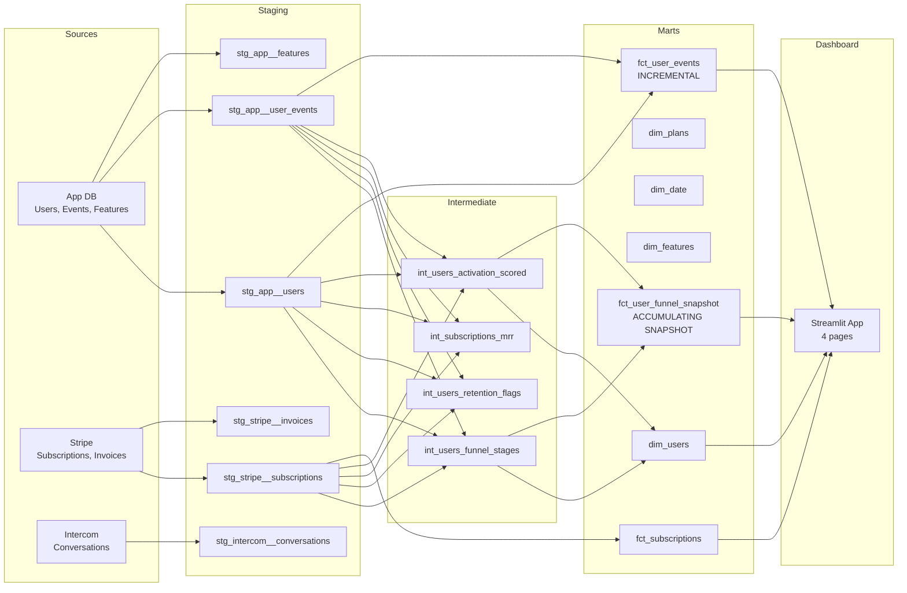

# FlowBoard Analytics

End-to-end analytics engineering project for **FlowBoard**, a B2B project management SaaS serving 8,000 users across US, UK, and Australia.

## Problem Statement

FlowBoard's free-to-pro conversion rate is 4.2% (industry average: 7-10%). Product suspects broken onboarding: users sign up and create a board but never invite team members -- the hypothesized "aha moment." Data is scattered across the app database, Stripe, and Intercom.

## Key Finding

> **Users who invite 2+ team members within 72 hours convert at 11.3% vs 2.1%.** Recommended in-app nudge sequence targeting this activation milestone. Australia region shows 23% higher NRR -- attributed to Enterprise-heavy mix, suggesting regional pricing optimization opportunity.

## Architecture



## Data Architecture

| Layer | Materialization | Models | Description |
|-------|----------------|--------|-------------|
| **Sources** | Raw tables | 6 tables | App DB, Stripe, Intercom |
| **Staging** | VIEW | 6 models | Clean, rename, type-cast |
| **Intermediate** | VIEW/TABLE | 4 models | Business logic transforms |
| **Marts** | TABLE | 7 models | Star schema for analytics |

### Star Schema

**Fact Tables:**
- `fct_user_events` -- Incremental materialization (1.99M rows). Demonstrates handling large event tables.
- `fct_subscriptions` -- Subscription lifecycle with MRR, duration, plan changes.
- `fct_user_funnel_snapshot` -- Accumulating snapshot (Kimball pattern). One row per user, timestamp columns for each funnel milestone.

**Dimension Tables:**
- `dim_users` -- 8,000 users with attributes, activation scores, funnel stage.
- `dim_plans` -- Free ($0), Pro ($29/mo), Enterprise ($99/mo) with feature flags.
- `dim_date` -- Standard date dimension (Sep 2024 - Mar 2026).
- `dim_features` -- 15 product features with plan gating.

### Funnel Milestones

| Stage | Milestone | Conversion |
|-------|-----------|------------|
| 1 | Signed Up | 100% |
| 2 | Created First Board | ~99% |
| 3 | Invited First Member | ~32% |
| 4 | Active in Week 2 | ~28% |
| 5 | Upgraded to Paid | ~5% |

### Activation Scoring (0-100)

| Signal | Points | Weight |
|--------|--------|--------|
| Board created | 20 | Core action |
| Members invited (2+) | 30-40 | **Key signal** |
| Tasks created (2+) | 10-20 | Engagement |
| Active days (3+) | 10-20 | Consistency |

**Activated = invited 2+ members in week 1** (conversion lift: ~5.8x)

## Data Dictionary

### dim_users
| Column | Type | Description |
|--------|------|-------------|
| user_id | VARCHAR | Primary key |
| region | TEXT | US, UK, AU |
| signup_source | TEXT | organic, google_ads, referral, product_hunt, content_marketing |
| current_plan | TEXT | free, pro, enterprise |
| activation_score | INT | 0-100 activation score |
| is_activated | BOOL | Invited 2+ members in week 1 |
| max_funnel_stage | INT | 1-5, highest milestone reached |
| lifecycle_stage | TEXT | signed_up_only, created_board, invited_member, retained_week2, converted |

### fct_user_funnel_snapshot
| Column | Type | Description |
|--------|------|-------------|
| user_id | VARCHAR | Primary key |
| signed_up_at | TIMESTAMP | Milestone 1 |
| created_first_board_at | TIMESTAMP | Milestone 2 |
| invited_first_member_at | TIMESTAMP | Milestone 3 |
| active_in_week_2_at | TIMESTAMP | Milestone 4 |
| upgraded_to_paid_at | TIMESTAMP | Milestone 5 |
| hours_to_first_board | NUMERIC | Lag time |
| hours_to_conversion | NUMERIC | Time to paid |

### int_subscriptions_mrr
| Column | Type | Description |
|--------|------|-------------|
| report_month | DATE | Monthly grain |
| new_mrr | NUMERIC | First paid subscriptions |
| expansion_mrr | NUMERIC | Upgrades (free->pro, pro->enterprise) |
| contraction_mrr | NUMERIC | Downgrades |
| churn_mrr | NUMERIC | Cancellations |
| net_new_mrr | NUMERIC | New + expansion - contraction - churn |
| ending_mrr | NUMERIC | Running total |

## Testing

55 data tests + 4 custom singular tests:

| Test | Type | Description |
|------|------|-------------|
| PK/FK | Generic | Unique + not_null on all primary keys, relationships on foreign keys |
| accepted_values | Generic | Plan types, regions, event types |
| `assert_funnel_milestones_chronological` | Singular | All milestones occur after signup |
| `assert_mrr_reconciliation` | Singular | Ending MRR = cumulative sum of net changes |
| `assert_no_events_before_signup` | Singular | No events exist before user signup date |
| `assert_retention_flags_boolean` | Singular | Retention flags are 0 or 1 |

## Dashboard

Four-page Streamlit app (`dashboards/app.py`):

1. **Product Health** -- Signups trend, activation rate, WAU/MAU ratio, current MRR
2. **Funnel Analysis** -- Interactive Plotly funnel, activation insight, regional breakdown
3. **Cohort Retention** -- Heatmap by signup cohort, segmented retention curves
4. **Revenue** -- MRR waterfall, growth trend, plan distribution, regional ARPU

## Quick Start

```bash
# Prerequisites: PostgreSQL running on localhost:5432
# Database: portfolio, Schema: flowboard, User: portfolio/portfolio_dev

# 1. Create virtual environment
python -m venv .venv
source .venv/Scripts/activate  # Windows

# 2. Install dependencies
pip install dbt-core dbt-postgres pandas faker numpy plotly streamlit psycopg2-binary

# 3. Generate and load data
python scripts/generate_synthetic_data.py
python scripts/compute_retention.py

# 4. Run dbt pipeline
dbt deps
dbt build --full-refresh
dbt docs generate

# 5. Launch dashboard
streamlit run dashboards/app.py
```

## Business Impact

- **Activation-driven onboarding**: Data proves that team invitation is the activation event. Recommended product changes: in-app nudge sequence prompting users to invite 2+ members within 72 hours of signup.
- **Regional pricing opportunity**: Australia's Enterprise-heavy user mix drives 23% higher NRR. Suggests opportunity for regional pricing optimization and Enterprise-focused GTM in AU/UK markets.
- **Churn prediction signals**: Activated users churn at 5% vs 15% for non-activated. Retention data enables proactive intervention for at-risk users who haven't completed activation milestones.

## Tech Stack

- **dbt** (1.11.6) -- Data transformation layer
- **PostgreSQL** (18) -- Data warehouse
- **Python** -- Synthetic data generation (Faker, NumPy, pandas)
- **Streamlit** + **Plotly** -- Interactive dashboard
- **Packages**: dbt-utils, dbt-expectations, dbt-date
